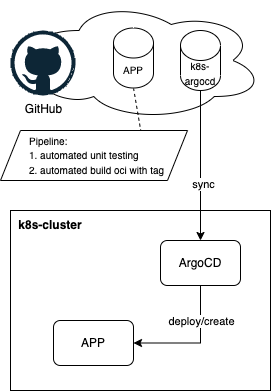

# Sem04 - K8s GitOps

This repository contains all definitions to manage the resources in my TuringPi 2 Cluster. It serves as the single source of truth for ArgoCD.

> Created during my semester thesis 4. More information can be found [here](https://cloud-native-engineering.github.io/sem04_docs/).

## Overview

This repository demonstrates the GitOps process using ArgoCD to manage Kubernetes deployments. ArgoCD ensures that the Kubernetes cluster state matches the desired state defined in git, making git the single source of truth.

## GitOps Workflow

The GitOps workflow in this repository separates the source code and Kubernetes definitions into different repositories:

1. **Source Code Repository**: Contains the application code and its CI/CD pipeline, which publishes an Open Container Image (OCI).
2. **Kubernetes Repository**: Uses the OCI from the source code repository and deploys it to the cluster using ArgoCD.

### ArgoCD

ArgoCD is a declarative, GitOps continuous delivery tool for Kubernetes. It compares the state defined in git with the actual state in the cluster and synchronizes them.

### Dependabot Integration

Dependabot keeps ArgoCD up to date by opening pull requests for new versions. Service owners can merge these pull requests to deploy the updates. After merging, ArgoCD synchronizes the cluster with the updated git definitions.

## Contents & Applications

This repository includes the following applications and definitions:

| Application Name | Namespace       | Description                         |
| ---------------- | --------------- | ----------------------------------- |
| longhorn         | longhorn-system | Storage management                  |
| cert-manager     | cert-manager    | Certificate management              |
| nginx-ingress    | ingress-nginx   | Ingress controller                  |
| gitea            | gitea           | Self-hosted Git service             |
| nextcloud-int    | nextcloud-int   | Test/Integration Nextcloud instance |
| nextcloud-prod   | nextcloud-prod  | Production Nextcloud instance       |

## License

This project is licensed under the [MIT License](https://opensource.org/licenses/MIT). See the [LICENSE](LICENSE) file for details.

## Author

Created in 2024 by [Yves Wetter](mailto:yves.wetter@edu.tbz.ch).
